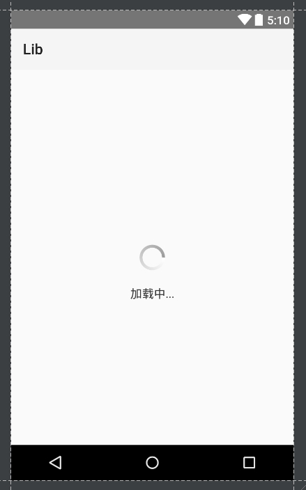
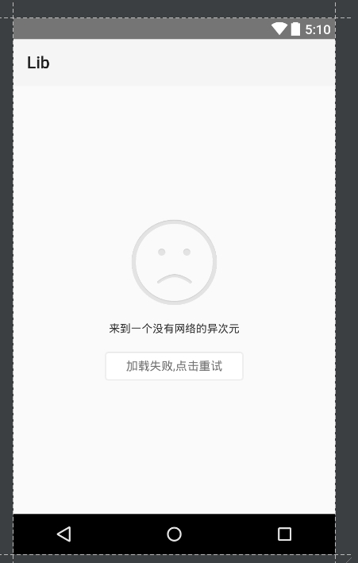

# PageManager
页面状态管理

[](https://jitpack.io/#hss01248/PageStateManager)

在张鸿洋的[LoadingAndRetryManager](https://github.com/hongyangAndroid/LoadingAndRetryManager)的基础上改写,优化api,封装常用的逻辑.

# API

## BaseApplication里的初始化

```
public static void initInApp(Context appContext)//使用默认提供的几个状态页面

/**
自定义状态页面,传入相应的layout文件的id即可.
* 如果需要后续调用自定义空白msg,错误msg字符串的api,则页面中显示该字符串的textview的id必须为tv_msg_empty,tv_msg_error
*/
    public static void initInApp(Context appContext,int layoutIdOfEmpty,int layoutIdOfLoading,int layoutIdOfError)
```


## 页面中生成PageManager对象

```
  /**
     *
     * @param container  必须为activity,fragment或者view.如果是view,则该view对象必须有parent
     * @param retryAction 点击重试的动作,注意,只需要关注有网络的情况,无网络状态时已经封装好:弹出对话框询问用户是否去设置网络
     * @param isShowLoadingOrContent 第一次是显示loading(true)还是content(false)
     * @return 当前页面的状态管理器
     */
    public static PageManager init(final Object container, boolean isShowLoadingOrContent ,final Runnable retryAction)
    
    //如果当前页面的空白状态下,提示语需要自定义,则调用此方法
    public static PageManager init(final Object container, final CharSequence emptyMsg, boolean isShowLoadingOrContent ,final Runnable retryAction)
```

## 控制页面状态

```
public void showLoading()
public void showContent()
public void showEmpty()
public void showError()
public void showError(CharSequence errorMsg)
```


# 默认的几个页面状态UI图

 

 


 


无网络时弹出dialog:

 

# 使用

## gradle

**Step 1.** Add the JitPack repository to your build file

Add it in your root build.gradle at the end of repositories:

```
    allprojects {
        repositories {
            ...
            maven { url "https://jitpack.io" }
        }
    }
```

**Step 2.** Add the dependency

```
    dependencies {
            compile 'com.github.hss01248:PageStateManager:1.0.2'
    }
```


## 示例代码

```
 pageStateManager = PageManager.init(this, "空空快快快快快快快快快快快快",true,new Runnable() {
            @Override
            public void run() {
                Toast.makeText(MainActivity.this,"点击重试了...",Toast.LENGTH_LONG).show();
                doNet();
            }
        });
        
        


 private void doNet() {
        pageStateManager.showLoading();
        
        handler.postDelayed(new Runnable() {
            @Override
            public void run() {
                int  state = new Random().nextInt(3);
                switch (state){
                    case 0:
                        pageStateManager.showError("哈哈哈哈哈错误了");
                        break;
                    case 1:
                        pageStateManager.showEmpty();
                        break;
                    case 2:
                        pageStateManager.showContent();
                }

            }
        },2000);
    }
```

# 注意事项

1.给view对象设置状态时,该对象必须有parent

2.失败页面的无网络状态已经处理,runnable里只需要包装有网络时的处理动作.


# blog

[介绍一下页面状态管理类PageStateManager,我实在看不下去你们直接用Layout](http://www.jianshu.com/p/665a69e9436b)
